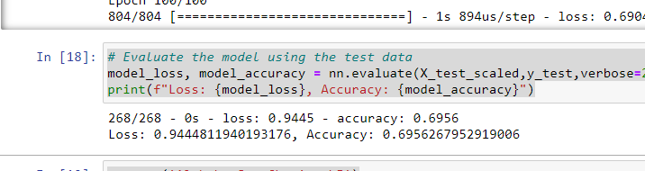
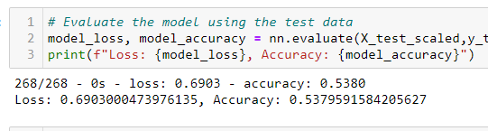
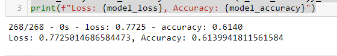
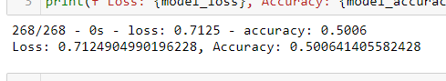

# Neural_Network_Charity_Analysis

## Overview of the analysis

##### This analysis seeks to use the Neural Network Model to learn with AlphabetSoup historical data with a view to determining which applicants should be awarded grants based on their likelyhood to effectively utilize the grants. A threshold of 75% accuracy is set for a viable model.

## Results

##### The data was extracted from a csv file and processed as follows:

* Out of the original 12 columns in the file the IS_SUCCESSFUL column was determined to be the target for the model.
* The EIN and NAME columns would make no contribution to the model and were therefore droped from the data.
* The remaining 9 columns were determined to be the features of the model.
* The model used for the analysis was a deep learning model with 2 hidden layers. The first layer had 80 nodes (neurons), and the second layer had 30 nodes. Relu activation factor was used for the hidden layers while the output layer had Sigmoid activation factor.
* When the model was fitted with training and test data, it only achieved accuracy of 69% with a loss of 0.94. This falls below the 75% target for the analysis. 
* Some optimization steps were taken in a bid to increase the accuracy of the model. Theses include adding an addition hidden layer, and altering the features by changing binning parameters for some columns. The optimizations failed to increase the accuracy of the model.   

##  Summary

##### With regard to using AlphabetSoup historical data to determine the applicants that should be approved for grants, the deep learning model using both Relu and Tanh activation codes is inadequate as it falls below the 75% accuracy threshold for reliable classification and is therefore not recommended for this project. Perharps a different model such as Support Vector Machine (SVM) may produce a desired accuracy with the data.
